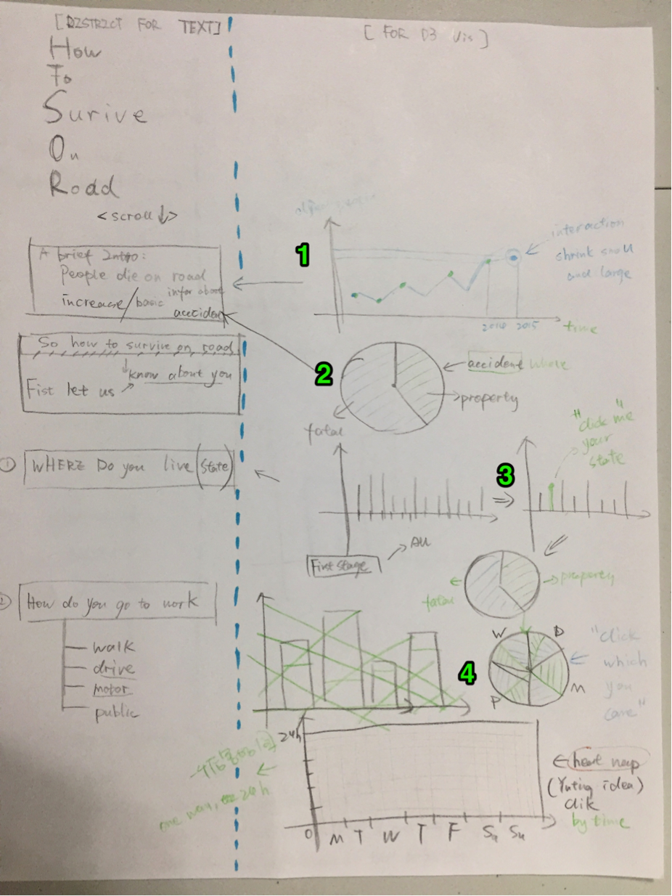
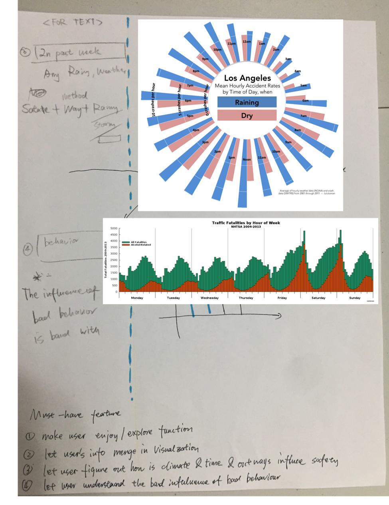
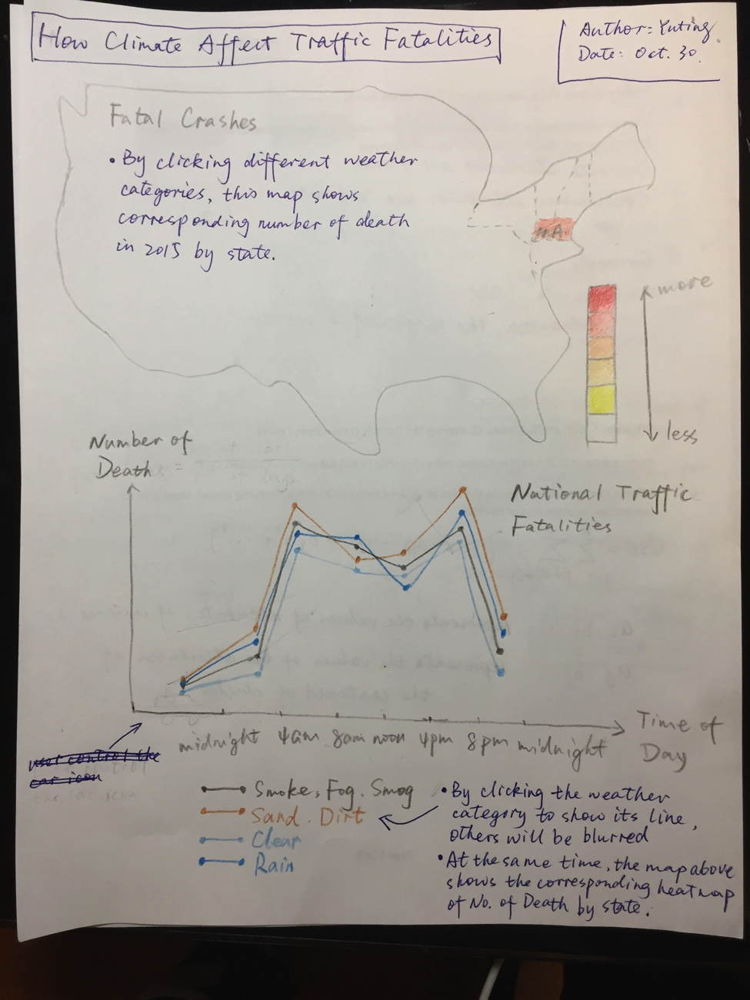
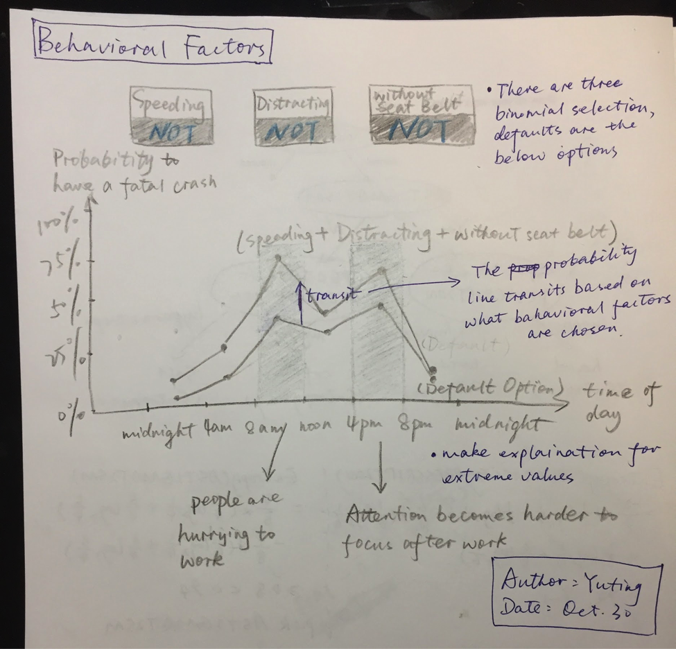
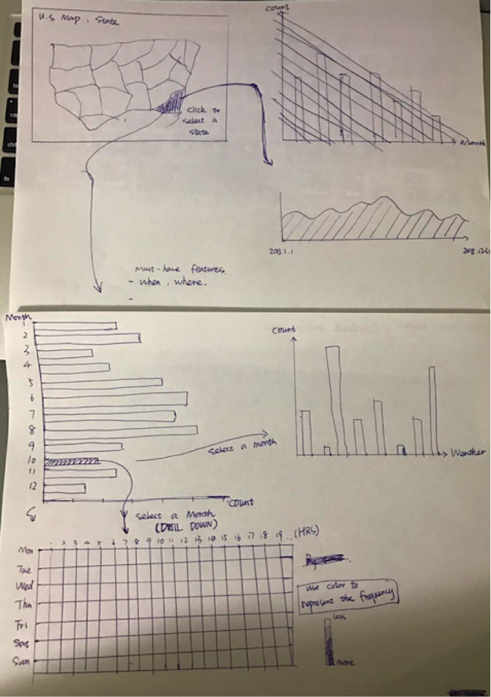
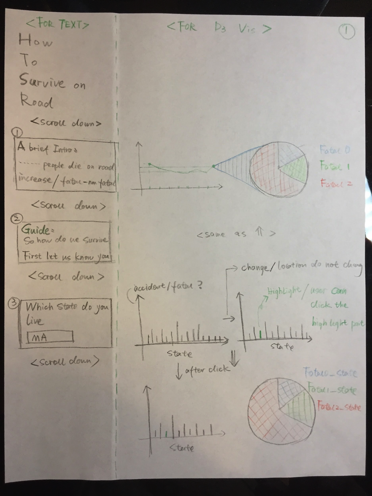
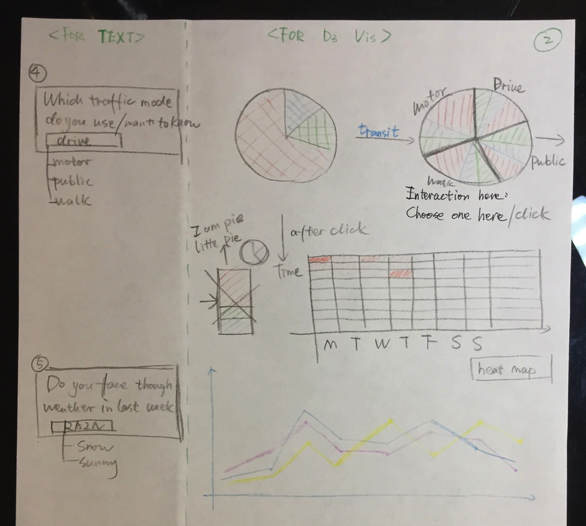
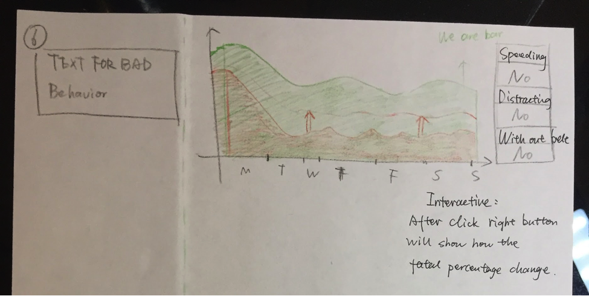

Proposal
=======

# Basic Information

**  Project Title: **  How to survive on road.

**Team Members:**

- Boya Zhou: bzhou@wpi.edu, boyazhou1993
- Yuting Liang: yliang3@wpi.edu, DarienLiang
- Caidan Liu: cliu7@wpi.com, CaidanLiu2,  

**Link:**

# Background and Motivation

In recent years, many safety actions, such as an increase in seat belt use and reduction in impaired driving, have helped decrease the number of traffic deaths. However, newly released government data paint a sobering picture of safety on the nation's roads and highways. Despite after decades of safety improvements, the number of people who died in car accidents reached 35,092 last year, according to newly released figures from the National Highway Traffic Safety Administration. That's a 7.2% increase over 2015. The last time there has a large single-year increase was back in 1966, when fatalities rose 8.1 percent from the previous year.

Based on above information, we want people to pay more attention about fatalities on the road and realize the evil influence of impaired driving, but in a less “preaching” way. So we plan to absorb some basic user information in our visualization. Meantime, we focus on the relationship between fatalities and some key factors (weather and bad behavior) to help people gain some insights if they want to avoid fatal crashes.

# Project Objectives

### Primary Question

- How to absorb the basic information of users in visualization?
- How might daily commute mode change affects fatal crashes?
- How might climate change increase the risk of fatal crashes in a community?
- How might we use studies of attitudes toward speeding, distracted driving, and seat belt use to better target marketing and behavioral change campaigns?

### Benefits
- Give strong sense of participation when user explore our visualizations.
- Display the relationship between key factors(daily commute mode, climate, and bad behavior) and traffic fatalities.
- Compare the pros and cons of different visualization.

# Data
The data was released by the the National Highway Traffic Safety Administration (https://www.whitehouse.gov/blog/2016/08/29/2015-traffic-fatalities-data-has-just-been-released-call-action-download-and-analyze).

# Data Processing
As the data needed are separated in several documents, join manipulation might be required. In this case, we use Python for implementation.

# Visualization Design
The layout logic of this project is an “question-answer-display-scroll down-question” way to show how to “survive” on road. Our design is a straight scroll down layout, the left ⅖ part is for descriptive part, the right ⅗ part is for visualization part.

### Alternative design

### Final Design
We keep the absorbing user information idea and website layout from Boya design. For the visualizations display relationship between key factors and traffic fatalities, we mainly choose the idea from Yuting when considering weather and bad behavior and heatmap idea from Caidan when considering daily commute mode.

The tradeoff here is that as we encourage users to participate in the the exploration process without involving complex interactions and address straight and concise information, much data will be abandoned.

#### First part

A general perspective of 2015 U.S. traffic fatalities will be provided.

** - Statistics Over Years **

- Show the trend of number of traffic fatalities over recent years with the dot of 2015 twinkling.
- Display the proportion of different types of crashes (based on level of fatalities) occurred in 2015 by clicking the twinkling dot in above chart.

#### Second Part
Interactive part for users to exploring how to survive on road will based on their own information.

** - Statistics by State **
- Display the number of (fatal/non-fatal) crashes happened in each state in bar charts
- The user will be asked to select where he/she lives in text part.
- The bar of the selected state by user will be highlighted.
- The highlight part will ask user to click that bar.
- A pie chart will be displayed with detailed information of a state by clicking the bar of this state.

** - Statistics by Commute Mode **
- From the pie chart above, display the difference between different travel modes, by divide in more detail dimension.
- The text part will ask people to choose one daily commute mode.
- The pie will shrinkage and move in left side and a heat map will show.
- Show the number of traffic fatalities in the chosen travel way in a calendar heatmap (given a state, given a traffic mode, a 7 * 24 grid, each grid represent the fatalities).
- When choose other commute mode on pie slice, the heat map will change.

** - Statistics by Weather **
- Display the trend of traffic fatalities(given a state) over the time of day by weather.
- By clicking the weather category that user is interested, other trends will be blurred.
- The reason why we chose line chart instead of radial bar chart to display traffic fatality trends overtime by weather, is that the data has around 10 weather categories, which is a burden for bar chart.

** - Statistics by Behavioral Factors **
- Three paired-chosen button are provided which representing three bad behaviors (speeding, distracting and without seat belt), and the default option is the best alternative: no speeding, no distracting and with seat belt.
- The traffic fatalities with the best behaviors displayed in the background as a benchmark.
- Display the number of traffic fatalities over time (weekdays) under the chosen conditions in a bar chart. The conditions can be combined.
- The design of condition combination can show the additive impacts of behavioral factors.

# Must-Have Features
 ### Discover
- Give users a general perspective of traffic fatalities in 2015 by time, state, etc.

### Sense of participation
- Absorb user information which might attract users more serious attention on traffic fatalities.

### Explore
- Help users identify the safest way for daily commute. As is mentioned by Mike Bostock, "Design is a search problem", users can have a strong visual impact by searching from different aspects including commute mode, weather, behavioral factors, etc.
- Provide reasonable explanations for extreme cases in visualizations which were not due to normal reasons.

# Optional Features
- Make an applet for predicting whether user will encounter a fatal crash or not based their own information.

# Project Schedule
- Nov. 6: Boya completed half of layout design and first four non-interactive charts; Caidan and Yuting completed the first interactive chart.
- Nov. 13: Boya completed prototype layout and Caidan and Yuting completed the last two interactive chart.
- Nov. 20: Compiled all elements into final project website
- Nov. 27: Completed the Process Book in the current state and presentation slides; rehearsed presentation
- Nov. 29: Prototype Presentation
- Dec. 6: Completed all coding work
- Dec. 9: Completed Process Book and video
- Dec. 13: Final Submission (with video)
